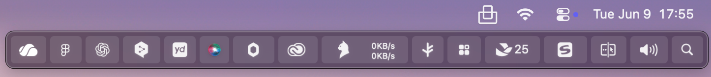

<h1 align="center">Tuck — Your Mac menu bar, finally organized.</h1>

  A lightweight macOS menu bar manager with one-click hiding, Shelf Mode for notched MacBooks, auto-hide, hover reveal, and private paid-once Pro controls.

  
  
  

  

> This repository is the public home for Tuck downloads, release notes, issues, and product information. The commercial app source code is not published here.

## What Tuck does

Tuck gives macOS a calmer menu bar without making you uninstall useful utilities. Put noisy status items to the left of Tuck, hide them with one click, and bring them back only when you need them.

<table>
  <tr>
    <td width="50%">
      <strong>Before</strong> 
      Every utility competes for permanent menu bar space.
    </td>
    <td width="50%">
      <strong>After</strong> 
      Tuck keeps the top edge clean while hidden tools remain one click away.
    </td>
  </tr>
  <tr>
    <td></td>
    <td></td>
  </tr>
</table>

## Highlights

| Feature | What it gives you |
| --- | --- |
| **Push Mode** | Hide every menu bar icon to the left of Tuck with one click. |
| **Shelf Mode** | Show hidden icons in a clean panel below the menu bar on notched MacBooks. |
| **Auto-hide** | Hide icons again after a delay. |
| **Hover reveal** | Peek at tucked icons without fully changing modes. |
| **Per-icon control** | Always show, always hide, or toggle individual menu bar icons. |
| **Keyboard shortcut** | Toggle from anywhere with <kbd>⌘⇧B</kbd>. |
| **Zero telemetry** | No analytics, tracking, or background behavior collection. |

## Download

- **Latest DMG:** [Download Tuck](https://usetuck.com/download/Tuck-1.0.10.dmg)
- **Website:** [usetuck.com](https://usetuck.com/)
- **Release notes:** [usetuck.com/releases](https://usetuck.com/releases)
- **GitHub Releases:** [QuartzInkStudio/Tuck releases](https://github.com/QuartzInkStudio/Tuck/releases)

## Languages

- [简体中文](docs/README.zh-CN.md)
- [日本語](docs/README.ja.md)
- [한국어](docs/README.ko.md)
- [Español](docs/README.es.md)
- [Français](docs/README.fr.md)
- [Deutsch](docs/README.de.md)

## Issues and feedback

Please open issues in this repository: <https://github.com/QuartzInkStudio/Tuck/issues>

Using GitHub Issues helps everyone:

- **One public place for feedback:** bugs, feature requests, compatibility reports, and release questions do not get lost in private email threads.
- **Transparent status:** other users can see whether a problem is known, being investigated, fixed, or released.
- **Better bug reports:** screenshots, macOS versions, Tuck versions, and reproduction steps stay attached to the same thread.
- **Community signal:** reactions and comments help prioritize the fixes and features that matter most.
- **Multilingual support:** you can write in your preferred language; short English summaries are helpful but not required.

For private billing, license, or account questions, email [support@usetuck.com](mailto:support@usetuck.com).

## Privacy

Tuck does not collect telemetry, analytics, or tracking data. Network access is limited to license validation and Sparkle update checks. macOS permissions are used only for menu bar interaction and Shelf behavior.

## More from Quartz

Tuck is built by [Quartz](https://quartz.ink/), an indie Mac studio making focused, private, paid-once tools for macOS.

- [Facet](https://facet.quartz.ink/) — a classic Launchpad replacement for macOS
- [PeekMark](https://peekmark.quartz.ink/) — native Markdown preview for Mac
- [Tuck](https://usetuck.com/) — menu bar organization for macOS
